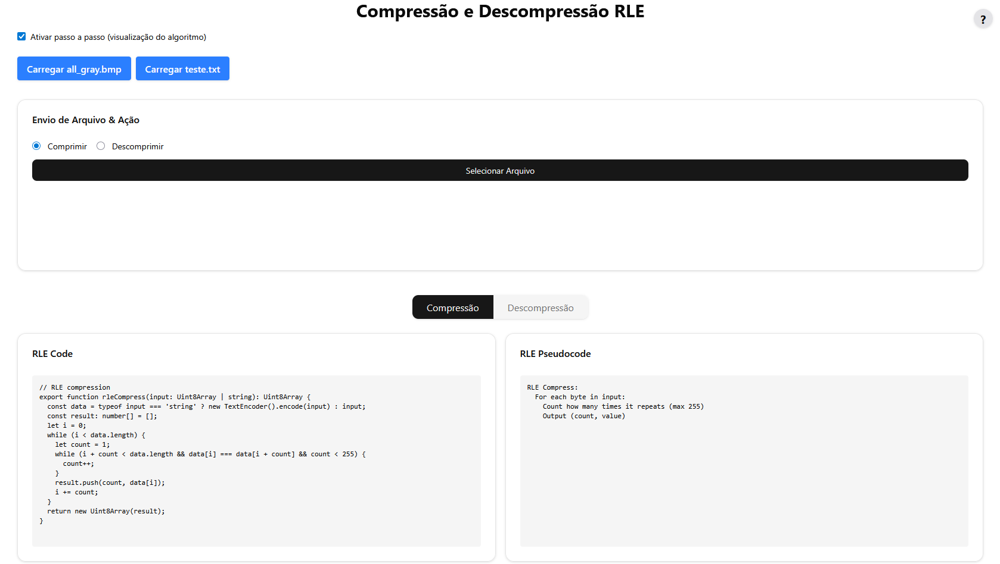

# [multimedia-compress](https://ufersa-procavalo.github.io/multimedia-compression/)

Aplicação web para compressão e descompressão de arquivos usando o algoritmo RLE (Run-Length Encoding), desenvolvida em React + TypeScript + Vite.



<details>
<summary><strong>Requerimento da Tarefa</strong> (clique para expandir)</summary>


Bom dia caros discentes!

Conforme combinado em sala, estou disponibilizando no SIGAA o material da aula sobre Compressão e Descompressão de Dados, bem como uma atividade prática de implementação de Técnicas de Compressão Sem Perda de Dados, como parte do conoteúdo da UND II da disiciplina.

A ideia que esta atividade seja feita INDIVIDUALMENTE, em que cada discente implementará um dos seguintes Algoritmos de Compressão Sem Perda (RLE e LZW) para codificar as funções de compressão e descrompressão de dados. Ao término do processo de implementação, os algoritmos devem ser testados, sendo fornecido para o algoritmo determinado para cada estudante um arquivo de entrada, executada a função de compressão e, por fim, o arquivo gerado como saída da função de compressão deve ser submetido à função de descompressão para retornar à versão original do arquivo de entrada.

A definição de qual algortimo a ser implementado por cada discente vai ser determinado pelo número de matrícula do aluno, conforme a seguir:

MATRICULAS PARES: RLE

MATRÍCULAS IMPARES: LZW

OBS.: Não há restrição de Linguagem de Programação para esta implementação!

</details>

## Funcionalidades

- **Compressão e descompressão RLE** de arquivos binários e texto.
- **Upload de arquivos** pelo usuário.
- **Exemplos prontos**: carregue arquivos de exemplo (`all_gray.bmp` e `teste.txt`) com um clique.
- **Visualização passo a passo** do algoritmo.
- **Download do resultado** comprimido ou descomprimido.

## Como funciona o RLE?

O RLE (Run-Length Encoding) é um algoritmo simples de compressão sem perdas que substitui sequências de bytes repetidos por um par (contagem, valor).

**Exemplo:**
- Entrada: `aaabbbbccdddddd`
- Comprimido: `[3, 'a', 4, 'b', 2, 'c', 6, 'd']`
- Descomprimido: `aaabbbbccdddddd`

## Arquivos de exemplo

- `all_gray.bmp`: Imagem BMP monocromática para testar compressão binária.
- `teste.txt`: Texto com repetições, ideal para visualizar o efeito do RLE.  
  Conteúdo:
  ```
  aaabbbbccdddddddeeeeffffggghhhiiiiijjjjkkkkllllmmmmnnnnooooppppqqqqrrrrssssttttuuuuvvvvwwwwxxxxyyyyzzzz
  ```

---

**Desenvolvido para fins didáticos e demonstração de algoritmos de compressão.**
